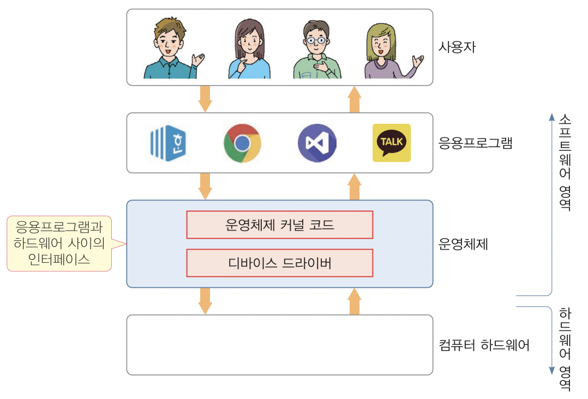

> 가상 주소와 물리 주소의 차이

1. **물리 주소 ( Physical Address )**
   - 실제 하드웨어 **메모리**에서 사용하는 주소
   - 이 주소는 RAM에서 직접 사용, **하드웨어 수준**에서 직접 주소 버스를 통해 접근
   - 물리 주소는 메모리 모듈이나 캐시 등과 같은 하드웨어 구성 요소와 관련이 있음
   - 물리 주소를 통해 직접적으로 메모리 위치 참조 할 수 있지만, 이는 운영 체제나 응용 프로그램이 메모리를 효율적으로 관리하기 어렵게 만들 수 있음
2. **가상 주소 ( Virtual Address )**
   - 가상 주소는 **응용 프로그램**이나 **운영 체제**가 사용하는 주소
   - 응용 프로그램은 가상 주소 공간에서 작동하며, **소프트웨어 수준**에서 직접적으로 접근
   - 가상 주소를 사용하는 이유는 여러 프로세스 간에 메모리를 분리하고, 논리적인 주소 공간을 제공하여 프로그램이 더 효율적으로 동작하도록 하기 위함
   - 가상 주소는 가상 메모리 관리 시스템에 의해 물리 주소로 변환되어야 실제 메로리에 액세스할 수 있음

|           | 물리 주소       | 가상 주소                |
| --------- | --------------- | ------------------------ |
| 사용 주체 | 하드웨어 메모리 | 응용 프로그램, 운영 체제 |
| 접근 수준 | 하드웨어 수준   | 소프트웨어 수준          |

물리 주소와 가상 주소는 위와 같은 차이점이 있으며 추후 상술할 다양한 이유로 가상 메모리 관리 시스템( 주로 운영체제가 수행한다 )을 통해 가상 주소는 물리 주소로 바뀌어 하드웨어에 액세스 할 수 있게 된다.

> 가상 주소 체계의 장점

1. **프로세스 격리 ( Process Isolation )**

각 프로세스는 독립적인 가상 주소 공간을 할당받게 된다. 따라서 다른 프로세스의 메모리에 직접 접근할 수 없다. 이러한 격리를 통해 다른 프로세스의 메모리에 접근하는 등의 치명적인 오류를 방지할 수 있다. 또한 한 프로세스에서 다른 프로세스의 메모리를 건드릴 수 없게 하기 때문에 보안성을 강화된다.

1. **프로세스 간 통신 ( Inter-Process Communucation, IPC )**

프로세스들 사이에 서로 데이터를 주고받는 행위 또는 그에 대한 방법이나 경로를 말한다. 가상 주소를 통해 효율적인 자원 공유 및 프로세스 간 통신을 가능하게 할 수 있다.

1. **스왑 ( Swapping )**

운영 체제는 가상 메모리를 사용하여 물리 메모리의 한계를 극복할 수 있다. 디스크에 스왑 영역이라고 불리는 개념이 있는데, 해당 스왑 영역을 설정함으로써 물리 메모리에 추가로 디스크까지 사용할 수 있게 설정할 수 있다. (Ref 1) 이러한 과정을 통해서 메모리의 한계보다 좀 더 높은 성능을 낼 수 있다.

1. **가상 주소 크기 조절**

가상 메모리 크기는 물리 메모리 크기와 독립적으로 조절할 수 있다. 이것을 통해서 정해진 물리 메모리보다 더 큰 프로그램을 실행시키거나 여러 프로그램을 동시에 실행할 때 유용하다.

가상 주소 체계의 대표적인 장점으로는 위와 같은 것들이 있다. 운영체제마다 가상 주소를 제어하는 방법이 조금씩 다르지만 거의 대부분의 컴퓨터 운영체제가 위와 같은 장점을 이유로 가상 주소 체계를 사용하도록 되어 있다. 이러한 가상 주소의 활용을 통해서 컴퓨터의 **동시성(Concurrency)**를 구현하여 보다 효율적으로 컴퓨터를 활용할 수 있게 할 수 있다.

> Page Table

페이지 테이블(Page Table)에 대한 간단한 이해를 돕기 위해서 고급 수준(High Level)인 소프트웨어의 관점에 대해서 먼저 짚고 넘어가보자.



(Ref 2)

앞서 정의했던 물리 주소와 가상 주소의 접근 수준을 표로 나타내는 것을 참고하면 **가상 주소는 소프트웨어 수준, 물리 주소는 하드웨어 수준**에서 접근하게 된다. 따라서 사용자가 다룰 수 있는 수준인 응용 프로그램 수준에서는 가상 주소만을 통해서 다양한 프로세스들을 다루게 된다. 사용자는 가상 주소를 사용하는 응용 프로그램을 제어하지만 결과적으로 물리 주소를 사용하는 하드웨어를 제어할 수 있는데, 이는 **가상 주소가 물리 주소로 변환**되기 때문이다.

사용자의 다양한 동작으로 하드웨어(컴퓨터)를 제어하기 위해서는 직접 물리 메모리에 접근해서 실제 데이터를 읽거나 써야 한다. 이러한 동작을 도와주는 것이 응용 프로그램과 컴퓨터 하드웨어의 중간에 위치한 **운영체제(OS)** 계층이다. 운영체제는 다양한 정책과 주소 변환 알고리즘 등을 통해서 가상 주소를 가지고 하드웨어 자원에 엑세스 하는 것을 돕는다. 자세한 설명은 추후에 다룰 예정이다.


(Ref 2)

따라서, 다음과 같이 응용 프로그램의 가상 메모리가 주소 매핑 테이블을 거쳐 물리 메모리의 주소로 변환되는데 여기서 **주소 매핑 테이블을 Page Table**이라고 부른다.

**페이지(Page)는** 정해진 고정 크기의 블록이다. 페이지는 두 메모리 공간 사이의 최소 전송 단위인데, 각 페이지의 크기는 시스템에 따라 다를 수 있지만 보통 4KB를 흔하게 사용하고, 가끔은 4MB를 사용하기도 한다.

페이지 테이블(Page Table)을 자세히 이해하기 위해서는 먼저 **Memory Management Unit(MMU)**에 대한 이해가 필요하다.


(Ref 3)

**메모리 관리 장치(MMU)**는 CPU가 메모리에 접근하는 것을 관리하는 컴퓨터 하드웨어 부품이다. 가상 메모리 주소를 실제 메모리 주소로 변환하며, 메모리 보호, 캐시 관리, 버스 중재 등의 역할을 담당한다.

CPU가 MMU에게 가상 메모리 주소를 넘겨주면 MMU는 그 주소를 받아 뒤쪽의 N비트( 이는 offset이라고 한다 )는 바꾸지 않고 앞쪽의 나머지 비트를 그에 해당하는 실제 메모리 주소로 바꾼다. 변환하는 과정에서 캐시의 역할을 하는 **변환 참조 버퍼(Translation Lookaside Buffer, TLB)**라는 CPU 내부에 존재하는 고속의 보조기억장치를 참조한다.
이 때, TLB에서 정보를 얻지 못해 가상 메모리 주소를 실제 메모리 주소로 바꿀 수 없는 경우(캐시 미스)에는 더 느린 방법을 통해서 페이지 변환 정보를 얻어오는데, **이** **페이지 변환 정보가 담겨 있는 자료구조를 페이지 테이블(Page Table)**이라고 한다.

페이지 테이블에 대한 설명을 추가하면 **Page Table은 Page Table Entries(PTEs)의 배열**이다.


(Ref 4)

위 사진은 물리 메모리를 포인팅하고 있는 페이지 테이블의 그림이다. 여기서 Page Table은 Page Table Entry(PTE) Row를 0부터 7까지 총 여덟 개를 가지고 있는데, 이러한 구조처럼 일련의 PTE를 가지고 있는 것이 페이지 테이블이다.

> Page Table Entry

페이지 테이블은 가상 주소 공간의 각 페이지에 대한 정보를 포함하는 **페이지 테이블 엔트리**(**Page Table Entry, PTE)**로 구성된다. PTE의 각 필드에는 일반적으로 다음과 같은 내용이 기록된다.

- **페이지 기본 주소 ( Page base address )**
- **플래그 비트**
  - 접근 비트 ( Access bit ) : 페이지에 대한 접근이 있었는 지를 나타낸다.
  - 변경 비트 ( Dirty bit ) : 페이지의 내용에 변경이 있었는 지를 나타낸다.
  - 존재 비트 ( Present bit ) : 현재 페이지에 할당된 프레임이 있는 지를 나타낸다.
  - 읽기/쓰기 비트 ( Read/Write bit ) : 읽기/쓰기에 대한 권한을 표시한다.

이렇게 페이지 테이블의 Row인 페이지 테이블 엔트리(PTE)는 위와 같은 정보들을 담고 있다. 여기서 **페이지 기본 주소**를 통해서 물리 메모리의 주소를 참조할 수 있으며, 플래그 비트를 통해서 다양한 권한을 제어할 수 있다.

> Page Fault

앞선 MMU에 대한 설명에 따르면 변환 참조 버퍼(TLB)나 DRAM에 존재하는 페이지 테이블 통해 실제 메모리 주소를 참조하지만, 마땅한 물리 주소를 찾을 수 없는 경우 참조할 페이지를 찾을 수 없는데, 이를 **페이지 폴트(Page Fault)**라고 한다.

대부분의 경우 페이지 폴트는 가상 주소 공간의 페이지가 실제 메모리에 없기 때문에 발생한다. 디스크에 있는 페이지를 물리 메모리에 올리지 못해서 이러한 일이 일어나게 되는데, 이 경우 운영체제가 그 처리를 담당한다. 비어 있는 메모리 공간에 페이지를 할당하거나, 비어 있는 메모리 공간이 없을 경우 실제 메모리의 한 페이지를 빼서 디스크에 저장한다. ( 이를 **페이징**이라고 한다 ) 이렇게 생긴 자리에 전달된 페이지를 할당한다.


(Ref 4)

위 사진을 통해 **페이지 폴트(Page Fault)**에 대한 이해를 도울 수 있다. 가상 주소를 가지고 PTE3을 통해서 물리 메모리 주소를 참조하려고 할 때, 포인팅하고 있는 페이지가 DRAM이 아니라 Disk에 존재하는 경우 이 때, 페이지 폴트가 발생한다. 이 경우에는 디스크에 있는 페이지를 DRAM에 올린 후 PTE3이 DRAM에 올라간 페이지를 포인팅하도록 하여 페이지 폴트가 일어나면 이와 같이 핸들링한다. 메모리에 올라와있는 프로세스의 주소를 디스크의 스왑 영역으로 내려 놓는 것을 **스왑(Swap)**이라고 부른다.

<aside>
 CoW을 넣을 것인가?

</aside>

이렇게 페이지를 스왑하는 과정에서 **카피 온 라이트(Copy-on-Write, CoW)**라는 방법을 쓰는데, 페이징이 일어나면 가상 메모리를 물리 메모리로 매핑하는데, 여러 프로세스가 동일한 페이지를 읽고 쓰는 경우가 발생할 수 있다.

이 때, CoW를 통해서 다른 프로세스에게 영향을 끼치지 않으면서, 바뀐 페이지 내용만 한 프로세스에서 CoW 방식을 통해 포인팅하게 된다.


(Ref 4)

위 사진은 CoW의 예이다. Process 1과 Process 2가 모두 같은 물리 메모리의 페이지를 포인팅하는 도중 Process 1의 가상 메모리가 포인팅하는 부분이 아주 약간 바뀌었다. 이 과정에서 CoW를 통해서 위와 같이 X를 포인팅하도록 바뀌게 된다.

Copy-on-Write에서 Copy의 역할을 수행하는 것은 **fork()**라고 하는 시스템 콜 함수이다. 그 후, Write하는 과정은 이후 다루게 될 Page Fault Handler 및 Replacement Policy에 의해서 운영체제에 맞는 방식으로 Write되게 된다.

> Page Fault Handler & Replacement Policy

**페이지 폴트 핸들러(Page Fault Handler)**는 페이지 폴트가 발생했을 때 실행되는 루틴을 말한다. 페이지 폴트가 발생하면 운영체제는 페이지 폴트 핸들러를 호출하여 필요한 페이지를 메모리로 로드하고 페이지 테이블을 갱신한다.

일반적으로는 다음과 같은 순서를 따른다.

1. 페이지 미스로 인한 페이지 폴트 발생
2. 알고리즘에 따라 페이지 폴트 핸들러가 **희생될 페이지(Victim)**를 골라 제외시킨다.
3. 그 후 페이지를 DRAM에 추가한 후 다시 주소 변환한다.

중간에 알고리즘에 따라서 페이지 폴트 핸들러가 알고리즘에 따라 페이지를 제외시키는데, 여기서는 다양한 알고리즘이 사용된다. 리눅스 커널 공식 문서를 참고하면 **페이지 교체 정책(Page Replacement Policy)**은 LRU(Least Recent Used) 방식에 기반을 둔 알고리즘을 을 사용한다(Ref 5)

이러한 과정을 통해서 **디스크에 있는 페이지가 필요할 때 메모리에 올라가는 것**을 **요구 페이징(Demand Paging)**이라고 부른다. 디스크에 있는 모든 페이지를 메모리에 올려놓고 사용하는 것이 아니라, 필요할 때만 페이지를 메모리로 가져와서 사용하는 것을 Lazy swapper라고 부른다.

메모리가 넉넉하여, `working set size < main memory size`인 경우에는 문제 없이 좋은 퍼포먼스를 보이겠지만, 반대로 메모리가 부족하여 `working set size > main memory size`인 경우를 생각해보자. 디스크의 모든 내용을 메모리에 올려둘 수 없기 때문에 필연적으로 **페이지 폴트**가 발생하게 된다. 이렇게 잦은 페이지 폴트로 인해 디스크와 메모리 사이의 페이지 스왑이 계속 발생하는 상황을 **쓰레싱(Thrashing)**이라고 부른다.

리눅스 기준으로 페이지 폴트에는 major fault와 minor fault의 두 가지 유형이 있다. 리눅스의 페이지 폴트 핸들러는 다음과 같은 여러 예외를 인식하여 핸들링하도록 한다.

| Exception                                                          | Type  | Action                                                                                                                                                                                                             |
| ------------------------------------------------------------------ | ----- | ------------------------------------------------------------------------------------------------------------------------------------------------------------------------------------------------------------------ |
| Region valid but page not allocated                                | Minor | Allocate a page frame from the physical page allocator                                                                                                                                                             |
| Region not valid but is beside an expandable region like the stack | Minor | Expand the region and allocate a page                                                                                                                                                                              |
| Page swapped out but present in swap cache                         | Minor | Re-establish the page in the process page tables and drop a reference to the swap cache                                                                                                                            |
| Page swapped out to backing storage                                | Major | Find where the page with information stored in the PTE and read it from disk                                                                                                                                       |
| Page write when marked read-only                                   | Minor | If the page is a COW page, make a copy of it, mark it writable and assign it to the process. If it is in fact a bad write, send a SIGSEGV signal                                                                   |
| Region is invalid or process has no permissions to access          | Error | Send a SEGSEGV signal to the process                                                                                                                                                                               |
| Fault occurred in the kernel portion address space                 | Minor | If the fault occurred in the vmalloc area of the address space, the current process page tables are updated against the master page table held by init_mm. This is the only valid kernel page fault that may occur |
| Fault occurred in the userspace region while in kernel mode        | Error | If a fault occurs, it means a kernel system did not copy from userspace properly and caused a page fault. This is a kernel bug which is treated quite severely.                                                    |

앞서 설명한 페이지 **교체 정책(Replacement Policy)**에 대한 공식 문서의 플로우 차트는 다음과 같다. 리눅스 커널은 다음과 같이 페이지 폴트를 다룬다.


(Ref 5)

공식 문서에 따르면, 대부분의 운영 체제와 마찬가지로 리눅스는 상주하지 않는 페이지를 처리하기 위한 fetch 정책으로 Deman Fetch 정책을 가지고 있다. 이러한 패치 정책은 주로 운영 체제가 페이지를 추적하고 할당하는 페이지 폴트 예외를 발생시킬 때, 하드웨어가 페이지를 백업 스토리지에서 가져오는 것을 의미한다.

> Signal

**시그널(Signal)**은 시스템 내에서 어떠한 이벤트가 발생했다는 것을 프로세스에게 알려주는 작은 메세지를 뜻한다. 커널은 예외나 인터럽트를 추상화하여 시그널로써 표현한다. 이러한 시그널은 커널 수준에서 관리되며 작은 정수값이다.

Linux 운영체제에서의 기본적인 시그널의 종류는 다음과 같다. 이 표는 알려진(Well-known) 시그널로서 리눅스 기반의 운영체제는 기본적으로 아래의 표를 기반으로 한다.


(Ref 6)

커널은 시그널을 프로세스에게 보내서 프로세스의 상태를 변화시킨다. 위 표에 따라 모든 프로세스는 기본적으로 정해진 동작을 수행하게 된다. 커널이 시그널을 보내는 이유는 다양한데, 프로세스의 내부적으로 외부적으로 발생할 수가 있다. 대표적으로는 다음과 같은 경우들이 있다.

- **Generated Internally**
  - Divide-by-zero 예외 (SIGFPE)
  - 자식 프로세스의 종료 (SIGCHLD)
- **Generated externally**
  - 다른 프로세스에 의해서 대상 프로세스(destination process)에 kill 관련 시스템 콜이 보내지는 경우

이러한 이유로 프로세스는 커널에 의해서 시그널을 전달받게 된다. 이러한 경우에는 세가지 경우로 동작하게 된다.

1. **명시적으로 시그널을 무시**
2. **default action 수행**
3. **시그널을 확인하고, 따로 정의된 시그널 핸들러 등을 사용한다.**

이러한 세가지의 방법이 있다. 예를 들어서 설명을 추가하면 다음과 같다.

1. **명시적으로 시그널을 무시하는 경우**

예를 들어 `SIGESGV` 시그널을 전달받는 경우는 세그멘테이션 폴트를 나타내는데, 이러한 경우에 정상적인 종료 대신에 시스템을 유지하고 디버그 및 프로파일링 정보를 수집하는 등의 작업을 수행할 수 있다.

1. **default action를 수행하는 경우**

이 경우는 가장 일반적인 경우로 개발자가 별도의 함수를 정의하지 않으면 기본적으로 정해진 동작(default action)을 수행한다. 시그널의 타입에 따라 정해진 다음과 같은 동작을 사용한다.

- **Abort ( term** ) : 프로세스를 종료한다.
- **Dump ( core )** : 프로세스를 종료하고 데이터를 덤프한다.
- **Ignore ( ign )** : 시그널을 무시한다.
- Stop ( stop ) : 프로세스가 멈춘다.
- **Continue ( cont )** : 프로세스가 멈춰있다면, 작동 중으로 바꾼다.

1. **시그널 핸들러를 사용하는 경우**

**시그널 핸들러(Signal Handler)**는 프로세스에서 커널의 시그널을 받았을 때, 시그널을 커스텀한 다른 함수로 핸들링할 수 있는 것을 의미한다. 예를 들어 프로세스가 종료 신호를 받기 전, 자식 프로세스를 모두 종료하고 나서 프로세스가 종료되게끔 하거나, 파일 디스크립터를 정리하고 나서 프로세스가 종료되게끔 개발자가 커스텀한 핸들러를 사용하게끔 할 수 있다.

> Signal Handler

바로 앞서 말했던 것처럼 시그널 핸들러는 커널에서 프로세스에게 보내는 시그널을 캐치하여 직접 정의된 함수가 실행되도록 한다. signal() 함수를 통해서 시그널 핸들러를 등록할 수 있다. 공식 문서에 따르면 프로그램이 운영 체제나 raise() 함수에서 인터럽트 신호를 처리할 수 있는 여러 방법 중 하나를 선택할 수 있게 한다고 한다. (Ref 7)

다음과 같은 형식을 통해서 커스텀 시그널 핸들러를 등록할 수 있다. sig 인수는 매크로 SIGABRT, SIGALL, SIGILL, SIGINT, SIGFPE, SIGIO, SIGOTHER, SIGSEGV, SIGTERM, SIGUSR1 또는 SIGUSR2 중 하나여야 하며, signal.h 포함 파일에 정의된다.

```c
#include<signal.h>

/* 형식
void ( *signal (int sig, void(*func)(int)) )(int);
*/

void myHandler(int sig) {
	/* SIGINT에 대해 정해진 동작 수행 */
}

int main(int argc, char *argv[]) {
	signal(SIGINT, &myHandler);

	/* 중략 */

	return 0;
}
```

위와 같이 C의 signal 헤더파일을 불러들인 다음 signal 함수를 통해서 개발자가 직접 정의한 myHandler를 등록했다. 위 경우에는 `SIGINT` 시그널에 대한 커스텀 핸들러로써 myHandler를 이용한다. 다음 파트인 Implementation에서는 시그널 핸들러를 통해서 주어진 소스 코드를 완성할 것이다.

## 참조

1. **[AWS]** 스왑 공간으로 사용할 메모리 할당 : [https://repost.aws/ko/knowledge-center/ec2-memory-swap-file](https://repost.aws/ko/knowledge-center/ec2-memory-swap-file)
2. **[운영체제]** 서울시립대학교 전자전기컴퓨터공학부 김영민 교수님 운영체제 강의 노트
3. **[wikipedia]** 메모리 관리 장치
4. **[시스템프로그래밍]** 서울시립대학교 전자전기컴퓨터공학부 홍정규 교수님 시스템프로그래밍 강의 노트
5. **[kernel.org]** Chapter 10 Page Frame Reclamation : [https://www.kernel.org/doc/gorman/html/understand/understand013.html](https://www.kernel.org/doc/gorman/html/understand/understand013.html)
6. **[man7.org]** Standard Signal : [https://man7.org/linux/man-pages/man7/signal.7.html](https://man7.org/linux/man-pages/man7/signal.7.html)
